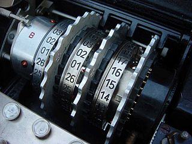

# Enigma_ConsoleApp
Simple Enigma crypto console emulator.

<h3>1. Введение</h3>

&nbsp;&nbsp;&nbsp;&nbsp;&nbsp;&nbsp;&nbsp;&nbsp;Энигма  –  самая популярная шифровальная машина. 

&nbsp;&nbsp;&nbsp;&nbsp;&nbsp;&nbsp;&nbsp;&nbsp;Она известна тем, что использовалась немцами во время второй мировой. Сегодня шифровальные машины уже в прошлом, операции шифрования и расшифрования выполняются на процессорах. Однако сами процессоры появились именно благодаря шифровальным машинам, потому что первым программируемым компьютером считается Колосс Марк 2, построенный в 1943 году для дешифровки другой немецкой шифровальной машины – «Lorenz SZ». 

<h3>2. Устройство Энигмы. Алгоритм шифрования</h3>

&nbsp;&nbsp;&nbsp;&nbsp;&nbsp;&nbsp;&nbsp;&nbsp;При нажатии на клавишу Энигмы ток не только зажигает лампочку с зашифрованной буквой, но и изменяет положение шестеренок, чтобы нажатие на следующую клавишу кодировалось по-другому, таким образом одна и та же буква будет кодироваться разными символами в зависимости от положений роторов. При этом буквы образуют пары, то есть кодируются друг другом, это позволяет расшифровывать сообщения Энигмы точно таким же образом как и зашифровывать, надо просто вводить текст и смотреть на лампочки. 

&nbsp;&nbsp;&nbsp;&nbsp;&nbsp;&nbsp;&nbsp;&nbsp;Роторов в Энигмах установлено от трех до четырех штук в зависимости от её предназначения и года выпуска, при этом Энигмы могли комплектоваться дополнительными сменными роторами для увеличения количества возможных комбинаций настроек.

  

